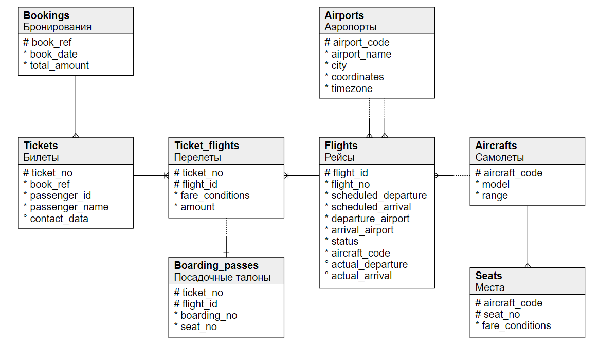

# FOR OTUS MENTOR:
## How to
1. [Run postgres (and all that is needed)](infrastructure.md)
2. Check homeworks:

   * [Old (scripts 0 - 7)](/dev-kit/build/deploy/local/postgres/sql)
   * Next
   * Two
   * Three 
  

3. I'm using sample dvdrental db:
   

   And airport tickets db:
   


4. Bad sql to improve (airports db):
```
EXPLAIN ANALYZE
SELECT  f.flight_no
		, f.scheduled_departure::date as vilet
		, a1.airport_name as from_air
		, a2.airport_name as to_air
		, count(s.seat_no)
		, count(tf.ticket_no)
FROM bookings.flights f
JOIN bookings.airports as a1 
	ON a1.airport_code = f.departure_airport
JOIN bookings.airports as a2 
	ON a2.airport_code = f.arrival_airport
JOIN bookings.seats as s 
	ON s.aircraft_code = f.aircraft_code
LEFT JOIN bookings.ticket_flights tf 
	ON tf.flight_id = f.flight_id
GROUP BY f.flight_id, f.flight_no, vilet, from_air, to_air
ORDER BY vilet
LIMIT 10;
```

  